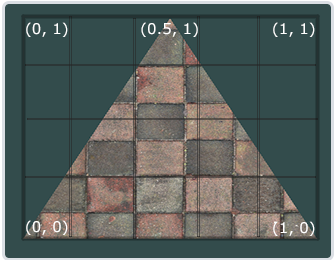

# 清洗UrbanBIS数据

把Longhua Qingdao Wuhu Yingrenshi Yuehai五个城市的可用房屋mesh数据以及其对应的材质图片提取出来

现在有可用的房屋mesh数据862个。

## 本周PLAN

### 删除无用纹理图片

写一个py脚本，先存储每一个mtl文件中提到的jpg文件，之后在wenli文件夹下搜索，只要是没有使用过的图片就删除,去除无用数据。

```python
import os
import re

def extract_texture_names(mtl_path):
    texture_names = set()
    with open(mtl_path, 'r') as mtl_file:
        for line in mtl_file:
            match = re.match(r'map_Kd\s+\.\.\/\.\.\/wenli\/([^\s]+\.jpg)', line)
            if match:
                texture_name = match.group(1)
                texture_names.add(texture_name)
    return texture_names

def delete_unused_textures(wenli_dir, used_texture_names):
    for texture_file in os.listdir(wenli_dir):
        if texture_file.lower().endswith('.jpg') and texture_file not in used_texture_names:
            texture_path = os.path.join(wenli_dir, texture_file)
            # 删除不需要的纹理
            os.remove(texture_path)
            print(f"Deleted: {texture_path}")

def process_building_folder(root_dir, building_folder):
    building_path = os.path.join(root_dir, building_folder, 'building')


    all_used_texture_names = set()

    for sub_building_folder in os.listdir(building_path):
        sub_building_folder_path = os.path.join(building_path, sub_building_folder)


        if os.path.isdir(sub_building_folder_path):
            mtl_files_path = sub_building_folder_path


            used_texture_names = set()

            # 针对mtl文件做图片名称提取
            for mtl_file_name in os.listdir(mtl_files_path):
                if mtl_file_name.endswith(".mtl"):
                    mtl_file_path = os.path.join(mtl_files_path, mtl_file_name)
                    used_texture_names.update(extract_texture_names(mtl_file_path))

            # 合并之前提取过的
            all_used_texture_names.update(used_texture_names)


    print(f"Used texture names in {building_folder}: {all_used_texture_names}")

    # 删除
    wenli_dir = os.path.join(root_dir, building_folder, 'wenli')
    delete_unused_textures(wenli_dir, all_used_texture_names)

if __name__ == "__main__":
    root_directory = "E:/UrbanBIS_useful/mesh/Yuehai"  

    # 遍历文件夹
    for building_folder in os.listdir(root_directory):
        building_folder_path = os.path.join(root_directory, building_folder)


        if os.path.isdir(building_folder_path):
            process_building_folder(root_directory, building_folder)
```

### 对建筑进行划分

在进行划分和第二次清洗后，得到652可用房屋mesh文件

### 给之前的Building3D建筑加纹理 :（

要在原有数据集的基础上添加纹理，最好的方法应该是在原来obj文件的基础上添加纹理坐标，然后使用外部mtl加载纹理图片，这里有必要学习一下，一个obj文件是如何加载一个外部纹理图片的。

想要构成一个面至少需要三个顶点。

下面是一个标准正方体的obj文件格式：

```plaintext
v 1.000000 1.000000 -1.000000
v 1.000000 -1.000000 -1.000000
v 1.000000 1.000000 1.000000
v 1.000000 -1.000000 1.000000
v -1.000000 1.000000 -1.000000
v -1.000000 -1.000000 -1.000000
v -1.000000 1.000000 1.000000
v -1.000000 -1.000000 1.000000

f 1 5 7 3
f 4 3 7 8
f 8 7 5 6
f 6 2 4 8
f 2 1 3 4
f 6 5 1 2

```
现在这个obj没有法线坐标也没有纹理坐标，仅仅作为展示一个模型如何通过连点成面构成一个简单的正方体mesh,可以看到每一个面都是由四个点连线得到，总共构成六个面。

加上顶点法线坐标，用来表示面的朝向

```plaintext
v 1.000000 1.000000 -1.000000
v 1.000000 -1.000000 -1.000000
v 1.000000 1.000000 1.000000
v 1.000000 -1.000000 1.000000
v -1.000000 1.000000 -1.000000
v -1.000000 -1.000000 -1.000000
v -1.000000 1.000000 1.000000
v -1.000000 -1.000000 1.000000
vn -0.0000 1.0000 -0.0000
vn -0.0000 -0.0000 1.0000
vn -1.0000 -0.0000 -0.0000
vn -0.0000 -1.0000 -0.0000
vn 1.0000 -0.0000 -0.0000
vn -0.0000 -0.0000 -1.0000
f 1//1 5//1 7//1 3//1
f 4//2 3//2 7//2 8//2
f 8//3 7//3 5//3 6//3
f 6//4 2//4 4//4 8//4
f 2//5 1//5 3//5 4//5
f 6//6 5//6 1//6 2//6
```
在表示面的那一列，如“1//1”中间空出来的部分是留给纹理坐标。

为了能够把纹理映射(Map)到一个面上，我们需要指定一个面的每个顶点各自对应纹理的哪个部分。这样每个顶点就会关联着一个纹理坐标(Texture Coordinate)，用来标明该从纹理图像的哪个部分采样。之后在图形的其它片段上进行片段插值(Fragment Interpolation)。

单个纹理坐标只需要处理二维即可，因为纹理图片只需要考虑二维表面上的映射问题。

像下面图片所示，指定了图片的三个点，之后把三个点分别链接到三个顶点坐标上，就表示这张纹理在哪一个面上

纹理坐标:
```plaintext
vt    0.0f  0.0f  # 左下角
vt    1.0f  0.0f  # 右下角
vt    0.5f  1.0f  # 上中
```

知道以上的内容后，准备一张纹理图片(texture.jpg),然后把这张纹理图完整的bia到正方体的每一个面上，obj内容如下：
```
mtllib untitled.mtl
v 1.000000 1.000000 -1.000000
v 1.000000 -1.000000 -1.000000
v 1.000000 1.000000 1.000000
v 1.000000 -1.000000 1.000000
v -1.000000 1.000000 -1.000000
v -1.000000 -1.000000 -1.000000
v -1.000000 1.000000 1.000000
v -1.000000 -1.000000 1.000000
vn -0.0000 1.0000 -0.0000
vn -0.0000 -0.0000 1.0000
vn -1.0000 -0.0000 -0.0000
vn -0.0000 -1.0000 -0.0000
vn 1.0000 -0.0000 -0.0000
vn -0.0000 -0.0000 -1.0000
#这四个点代表整张图片全部用到
vt 0 0
vt 1 0
vt 1 1
vt 0 1
f 1/1/1 5/2/1 7/3/1 3/4/1
f 4/1/2 3/2/2 7/3/2 8/4/2
f 8/1/3 7/2/3 5/3/3 6/4/3
f 6/1/4 2/2/4 4/3/4 8/4/4
f 2/1/5 1/2/5 3/3/5 4/4/5
f 6/1/6 5/2/6 1/3/6 2/4/6

```
最后效果如下图所示：


## 一些常用命令总结

powershell终端下运行该命令可以创建多个序列号文件夹(windows)

```powershell
1..100 | ForEach-Object {New-Item -ItemType Directory -Path ("building$_")}
```

统计一个文件夹下特定文件名后缀的文件数量,以obj文件举例

windows（cmd）

```cmd
dir /b /s /a-d "C:\Path\To\Your\Folder\*.obj" | find /c /v ""
```

linux

```bash
find /path/to/your/folder -type f -name "*.obj" | wc -l
```