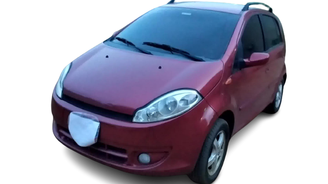

# Wonder3D环境配置

[项目仓库](https://github.com/xxlong0/Wonder3D)

[项目论文](https://arxiv.org/abs/2310.15008)
## 准备系统环境
系统为**ubuntu18.04**以上系统，**anaconda**环境装好，**cuda**版本为11.8或11.7，测试用12.2会报错，**gcc**版本8以上，**python**3.8以上，显卡确保**显存**足够，我先后在2080ti和titan显卡上均测试过，cuda版本为11.3和11.2，都会报cuda和pytorch版本不匹配的错，最后在4090上成功运行，所以一个准确合适的环境是重要前提。

## 安装环境
只要上一步系统环境准备完好，接下来依照官方教程即可
```bash
conda create -n wonder3d python=3.10 #这里用3.10是怕再有奇怪的报错，所以把版本调高
conda activate wonder3d
```
这两步结束后，先查看python和pip的路径是conda虚拟环境，用`which python`和`which pip`查询，如果返回时虚拟环境的路径，可以跳过这一步骤，如果不是
，显示为local路径，可以先退出现在的base环境，然后在换回来wonder3d环境

```bash
conda deactivate #退出wonder3d
conda deactivate #退出base
conda activate wonder3d #重新激活环境
```
下面是项目下载和必要环境的安装
```cmd
git clone https://github.com/xxlong0/Wonder3D #这里如果速度慢可以参考上一篇"服务器网络问题解决方案"，但这个只能用于大学教研室或是公司本地服务器
cd Wonder3D
pip install -r requirements.txt #这要下很久，可以去泡杯茶
pip install git+https://github.com/NVlabs/tiny-cuda-nn/#subdirectory=bindings/torch #这里很容易出问题，大部分问题都可以在"准备系统环境"中解决
```
安装完后看一下自己torch是否安装成功
```bash
python
```

```python
import torch
print(torch.__verison__)#查看版本号是否对应后退出即可
exit()
```
## 运行项目
先下载[checkpoint](https://connecthkuhk-my.sharepoint.com/personal/xxlong_connect_hku_hk/_layouts/15/onedrive.aspx?id=%2Fpersonal%2Fxxlong%5Fconnect%5Fhku%5Fhk%2FDocuments%2Fwonder3d%2Fpretrained%2Dweights%2Fckpts&ga=1)文件复制到指定目录下
```
Wonder3D
|-- ckpts
    |-- unet
    |-- scheduler.bin
    ...
```
之后可以直接运行命令看一下效果，代码会默认跑一只猫头鹰
```bash
bash run_test.sh
```
同理，此处出现错误请返回*系统环境*和*安装环境*这两个步骤查看是否出错，如果按照错误提示打补丁很可能越补窟窿越大
运行完成后可以在`./outputs`下查找相关文件，应该6个一一对应的法线图和色彩图

之后生成mesh obj文件，这里我只试了官方的第一种方法
```bash
cd ./instant-nsr-pl
bash run.sh output_folder_path scene_name
#第二条命令示例为:
bash run.sh  ../outputs/cropsize-192-cfg3.0 owl
```
生成完成后可以用`ls`命令找哪个文件夹是新生成的说明obj文件就存在哪了

如果想要替换自己的图片，先把图片的背景去掉，在线网站就可以完成，然后去找`/wonder/configs/mvdiffusion-joint-ortho-6views.yaml`，修改如下内容即可


## 尝试其他图片
我用该方法尝试了下最近师姐让找的car图片，因为该项目训练时没有车的训练模型，所以图生3D的效果不是十分理想。
### car1

### car2

### car3


## 总结
锻炼了自己的环境配置功力，还有在项目介绍看到可以使用正交相机来完成对obj色彩的显示，原文如下：
>Our generated normals and color images are defined in orthographic views, so the reconstructed mesh is also in orthographic camera space. If you use MeshLab to view the meshes

这个可以帮到我最近在研究的对对房屋mesh涂上迷彩的问题。
